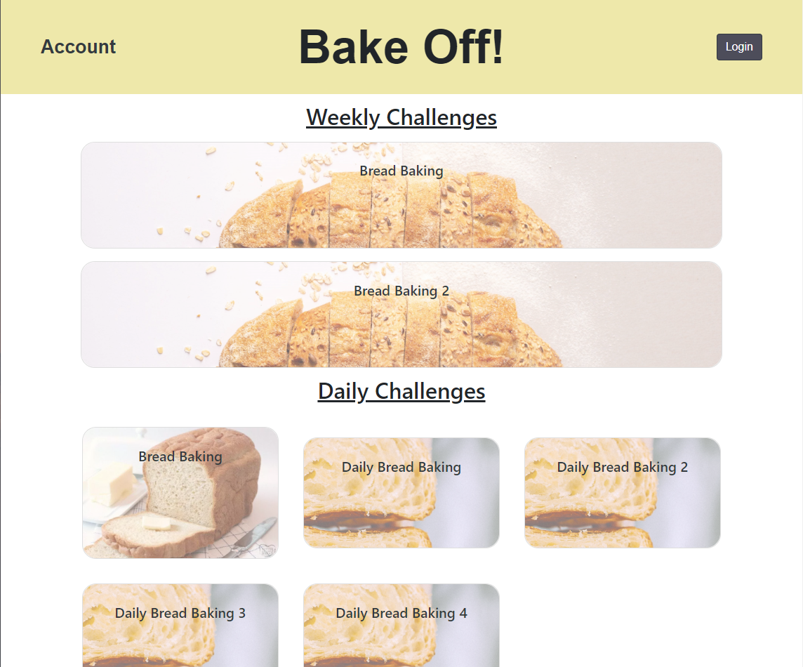
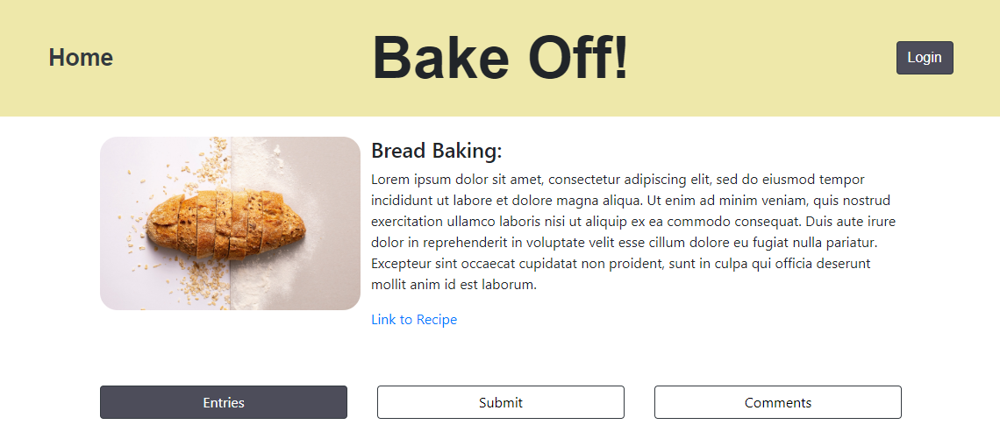
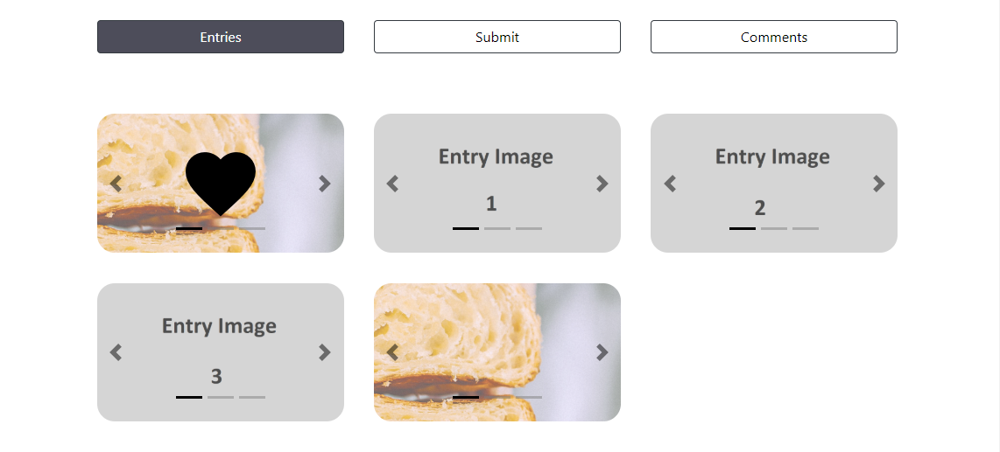
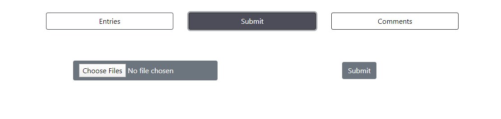
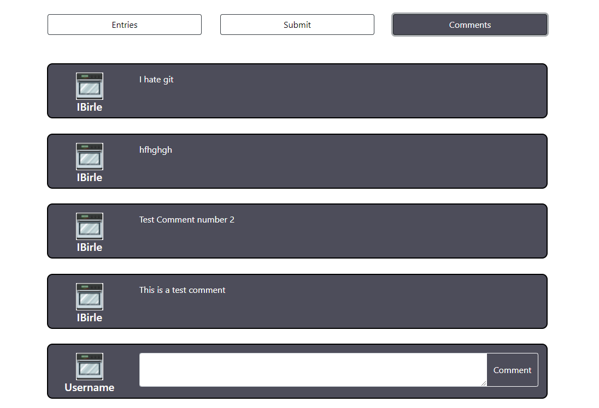
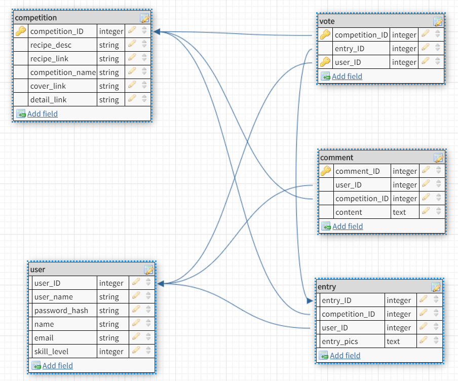

# Alpha

# Bake Off!

# Spring 2020

# Overview

BakeOff is a baking and cooking challenge website. Users can pick between different recipes and submit pictures of their creations to the website. They compete against other users making the same recipe. Users can then vote on which submission looks the best. The goal is to get bakers and cooks together making the same recipe. The comment section allows these users to talk and share their successes and mistakes. In the end we hope to bring people together around a collective hobby.

# Team Members:
Alain Duplan, alain-duplan  
Alex Winter, alexmwinter  
Ian Birle, ibirle

# User Interface

Updates from Milestone 2: For this milestone we added multiple users to select from in the upperleft corner of the screen on index.html in order to show off that multiple users interact with the back end correctly. Comments, entries, and votes will be tied to the username as intended for any challenege on the front page. Comments will show the correct username based on which account posted them, and a user's vote on a challenge entry will be seen if they refresh or re-enter the page. This was done like this in order to show off the back end implimentation with out having to implement user authentication. 

NOTE: ONLY THE FIRST WEEKLY CHALLENGE HAS DATA THAT IS LOADED IN FROM THE BACK END. IT IS SET UP TO WORK, BUT ONLY THAT CHALLENGE HAS ANY DATA IN IT.

A place for users to view all current challenges they can participate in or view. Clicking on one takes them to a Challenge specific page that goes more in depth.

This is where the user will be brought to after clicking on a specific challenge from the previous index.html page. Here they will see a description of the challenge as well as a link to an outside resource for the recipe.

Below the challenge at the top of the page there are three tabs to choose from the first of which is entries. These are all current entries that have been submitted for the challenge above. The user can scroll through each of an entry’s carousel images and then choose to like any one of the entries by clicking on the empty heart that shows up on hover to cast their vote as to which entrant is their favorite.

In this middle tab of the challenge page users are able to submit pictures of their entry for other users to vote on. They can select images with the button on the left and upload them with the button on the right.

The right tab of the challenge page is for user comments on the challenge. This is for tips and tricks or just general comments on the recipe as a whole. Not too specific on this one.

# APIs of Project
All of our requests are POST requests
See database diagram for the object definitions

1. /api/getChallengeVote
* Params: user_ID, challenge_ID
* Returns: Array of the vote informaton from the vote table
2. /api/getAllCurrentChallenges
* Params: None
* Returns: Array of Competition objects
3. /api/getChallenge
* Params: challengeID
* Returns: Returns one competition object with competition_id = challengeID 
4. /api/getEntries
* Params: challengeID
* Returns: Returns all entry objects with competition_id = challengeID
5. /api/getComments
* Params: challengeID
* Returns: Returns all comment objects with competition_id = challengeID
6. /api/submitEntry
* Params: user_ID, competition_ID, urls (Urls are a list of the urls to the images uploaded directly to aws S3)
* Returns: nothing
*Note: Inserts a new entry into the database with the above params
7. /api/voteFor
* Params: entry_ID, user_ID, competition_ID
* Returns: nothing
*note: adds a vote in the database for the given entry with the given userID. Switches the vote if that user has already voted in this competition
8. /api/submitComment
* Params: comment_content, user_ID, competition_ID
* Returns: nothing
*note: adds a comment in the database that will be displayed in the given competition page with the username of the user_ID
9. /api/sign-s3
* Params: takes in a file signature of a file a user is trying to upload to aws S3
* Returns: url with signature to upload the previous image to
*note: This is used to validate files to allow users to directly upload images to aws S3. Gives an authorization for each image posted that S3 will except

# Database fields

1. competition table
* competition_ID: primary key auto incremented id for the competition
* recipe_desc: description of the recipe fvor the competition
* recipe_link: Link to the recipe
* competition_name: name of the competition
* cover_link: link to the image to be used on the home page of the website
* detail_link: link to the image to be used on the competition page

2. user table
* user_ID: primary key auto incremented id for the user
* user_name: user name
* password_hash: unused, but for authentication if needed
* name: name of user
* email: email of user
* skill_level: number 1 - 5 of user's skill level in cooking

3. vote table
* competition_ID: competition the vote is being cast in.
* entry_ID: the entry that the user is voting for
* user_ID: the user that is casting this vote

4. comment table
* comment_ID: primary key auto incremented id for the comment
* user_ID: user who is commenting
* competition_ID: the copetition being commented on
* content: the actual text of the comment

5. entry table
* entry_ID: auto incremented id for the competition
* competition_ID: the competition being entered
* user_ID: the user entering the competition
* entry_pics: an stringified array of url's to the images for this entry

Implemented preset "users" that will utilaize the functionalities of the website.

# URL Routes/Mappings

Since we did not complete Authentication we really only have 2 URL Routes. One for the index page, and then one for the challenge pages. Eventhough there are only two actual pages, we have a tab system on the challenge page that compacts a lot of functionality into one page.

The front index page will show the same info based on data it pulls from the back end, but the challenge page uses the query section of the URL to render the page.

URL: https://bake-off-alpha.herokuapp.com/challenge_page.html?challengeID=#&userID=#

The # in the url above is a placeholder for the challengeID and userID that are decided based on the username and challenege selected from the front page.

Refer to the API section for information regarding their routes.

# Authentication

Our group did not implement Authentication and instead have a drop down of three users to pick from on the front page in order to showcase how multiple users were function on the backend.

# URL

Bake Off’s URL: https://bake-off-alpha.herokuapp.com/

# Division of labor

Each team member worked on a vertical chunk from front end down to the back end query. We helped each other throughout, but we listed who had the major contributions / was responsible for each part.

1. /api/getAllCurrentChallenges
* Ian and Alex
2. /api/getChallenge
* Alex
3. /api/getEntries
* Alex
4. /api/getComments
* Alain
5. /api/submitEntry
* Ian
6. /api/voteFor
* Alex
7. /api/submitComment
* Alain
8. /api/sign-s3
* Ian
9. /api/getChallengeVote
* Ian, Alex, and Alain

*   Index Page
    *   Card Design
        *   Alex
    *   Basic Structure
        *   Ian
    *   Top Banner
        *   Alex
    *   Card grid layout
        *   Ian
    *   Wireframe
        *   Alex
*   Challenge Page
    *   Carousel Design
        *   Ian
    *   Carousel Grid Layout
        *   Ian
    *   Comment section
        *   Alex
    *   Nav-Bar Layout
        *   Alex
    *   Nav-Bar JS
        *   Ian
    *   Submit section
        *   Ian
    *   Recipe Block
        *   Alex
    *   Wireframe
        *   Ian
*   Login/Account
    *   Structure
        *   Alain
    *   Login page
        *   Alain
    *   Account page
        *   Alain
    *   Edit account
        *   Alain

Connection to Heroku and AWS S3: Ian

# Division of labor

Overall we learned a lot by creating this website. We found that a lot of the things we learned about front end didn't make sense until we started using it in our own project. The first big challenge we had was creating the column layouts on the index page. We had to learn how the boostrap columns work which isn't intuitive at first. After that we want things to line up and this took a good understanding of borders, margins and paddings. Additionally we had problems with the column when we used different sized images. We solved this by editing all the admin created images before uploading them to the website. The next challenge we had was generating the html elements with data we inserted. This was challengeing, but it was easy to replicate once we create one element. Lastly the hardest part was uploading images. Heroku had a pretty good guide on their site, but we had to convert the code to use async/await. Additionally it was hard to debug since Amazon S3 didn't return the most helpful things in it's responses. In the end we had some permission issues on S3, but it worked smoothly after that. 

We faced a lot of challenges. but figuring them out taught us a lot about Web programming. The thing we learned most about is webpage struture/layout and using borders/margins/paddings along with boostrap gridlayout. 

The things we would have liked to learn about more before the project would have been creating html items from scratch and more about layingout webpages. We used boostrap col grid layout for our webpage and we thought that was the most helpful thing for the actual structure of our website. It would have been very helpful to learn about this before the project. 