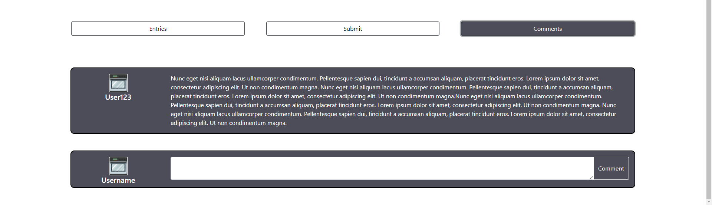
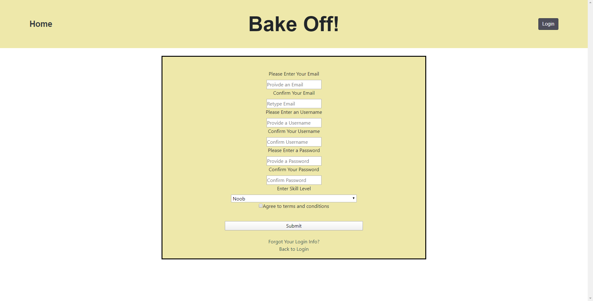

Bake Off! (Title might change)

# Team Members:
<ul class="c3 lst-kix_2zz20i8si0b6-0 start"><li class="c1">Alain Duplan, alain-duplan</li><li class="c1">Alex Winter, alexmwinter</li><li class="c1">Ian Birle, ibirle</li></ul>

# Important Idea

A website that will host baking competitions. There will be a given recipe for each competition and users can upload pictures of what they baked. Other users can then vote on which person baked the best looking version of that recipe. There will also be a section for user&#39;s tips and tricks / questions people have about the recipe. The idea is to bring bakers together and let them learn from others&#39; successes and mistakes.

Veterans and novices to baking alike can try their hand at weekly and/or daily baking recipe challenges that will be user generated and voted on. During our time in quarantine it would be fun to pick up a new skill and to practice in the comfort of one&rsquo;s own home while comparing their creations with others.

No similar website exists. There are similar things online, but they are all on facebook groups or similar platforms. 

# Data Interactions:

Create competitions &nbsp;

    Link to recipe &nbsp;

    Description and rules &nbsp;

    Add a start and end time to enter &nbsp;

    Add a start and end time to vote &nbsp;

    Restricted to admins &nbsp;

Browse competitions &nbsp;

    View all running competitions &nbsp;

    See details about a particular competition &nbsp;

Create user accounts &nbsp;

    Create account page &nbsp;

    Login page &nbsp;

    Basic info (Username, baking skill level, etc.) &nbsp;

Enter into competition &nbsp;

    View recipe &nbsp;

    Upload images as entry &nbsp;

    Allow others to vote for winner &nbsp;

Ending competition &nbsp;

    Select the winner based on &nbsp;the most votes &nbsp;

    Add badges to accounts of winners &nbsp;

Tips / question section &nbsp;

    Unique section under each competition &nbsp;

    Allow any user to post 

# Wireframe

We made the basic layout of some of the pages on Figma in order to organize some of our ideas before just getting them into HTML &amp; CSS. Here is a link to that document:

<a class="c9" href="https://www.google.com/url?q=https://www.figma.com/file/YpExW6oBGqRynRAgwFys4c/BakeOff&amp;sa=D&amp;ust=1586410552158000">https://www.figma.com/file/YpExW6oBGqRynRAgwFys4c/BakeOff</a>

# HTML &amp; CSS

<ul class="c3 lst-kix_5d8foyzbs0gj-0 start"><li class="c1">Home Screen: This is where the visitors will first be greeted to the website where they will be able to see all of the current challenges up to participate in. A large weekly challenge banner will always reside at the top of the page, while smaller daily challenges sit below that for less time intensive challenges.</li><li class="c1">Challenge Screen: After the user selects the challenge they either wanted to view the entries for or enter into themselves they would be taken here to see the actual description of what the recipe is as well as a link to an outside resource for the actual recipe (i.e. All Recipes).This page includes a list of current entries that visitors can vote on as to which one they think looks the best. These are limited to one vote per challenge per account. The next tab is for actually submitting one&rsquo;s own recipe to the challenge. The final tab is for comments that some people may have for ways in which they changed the recipe to make it better for them or even tips and tricks for others.</li><li class="c1">Login/Account Pages: Simply a page for the users to log in and edit their profiles with the applicable information. It will also be where they can choose what badges to show if they win any of the daily or weekly challenges. </li></ul>

# Division of Labor

<ul class="c3 lst-kix_55vr35h4j6g3-0 start"><li class="c1">Index Page</li></ul><ul class="c3 lst-kix_55vr35h4j6g3-1 start"><li class="c6 c8">Card Design</li></ul><ul class="c3 lst-kix_55vr35h4j6g3-2 start"><li class="c2">Alex</li></ul><ul class="c3 lst-kix_55vr35h4j6g3-1"><li class="c6 c8">Basic Structure</li></ul><ul class="c3 lst-kix_55vr35h4j6g3-2 start"><li class="c2">Ian</li></ul><ul class="c3 lst-kix_55vr35h4j6g3-1"><li class="c6 c8">Top Banner</li></ul><ul class="c3 lst-kix_55vr35h4j6g3-2 start"><li class="c2">Alex</li></ul><ul class="c3 lst-kix_55vr35h4j6g3-1"><li class="c6 c8">Card grid layout</li></ul><ul class="c3 lst-kix_55vr35h4j6g3-2 start"><li class="c2">Ian</li></ul><ul class="c3 lst-kix_55vr35h4j6g3-1"><li class="c6 c8">Wireframe</li></ul><ul class="c3 lst-kix_55vr35h4j6g3-2 start"><li class="c2">Alex</li></ul><ul class="c3 lst-kix_55vr35h4j6g3-0"><li class="c1">Challenge Page</li></ul><ul class="c3 lst-kix_55vr35h4j6g3-1 start"><li class="c6 c8">Carousel Design</li></ul><ul class="c3 lst-kix_55vr35h4j6g3-2 start"><li class="c2">Ian</li></ul><ul class="c3 lst-kix_55vr35h4j6g3-1"><li class="c6 c8">Carousel Grid Layout</li></ul><ul class="c3 lst-kix_55vr35h4j6g3-2 start"><li class="c2">Ian</li></ul><ul class="c3 lst-kix_55vr35h4j6g3-1"><li class="c6 c8">Comment section</li></ul><ul class="c3 lst-kix_55vr35h4j6g3-2 start"><li class="c2">Alex</li></ul><ul class="c3 lst-kix_55vr35h4j6g3-1"><li class="c6 c8">Nav-Bar Layout</li></ul><ul class="c3 lst-kix_55vr35h4j6g3-2 start"><li class="c2">Alex</li></ul><ul class="c3 lst-kix_55vr35h4j6g3-1"><li class="c6 c8">Nav-Bar JS</li></ul><ul class="c3 lst-kix_55vr35h4j6g3-2 start"><li class="c2">Ian</li></ul><ul class="c3 lst-kix_55vr35h4j6g3-1"><li class="c6 c8">Submit section</li></ul><ul class="c3 lst-kix_55vr35h4j6g3-2 start"><li class="c2">Ian</li></ul><ul class="c3 lst-kix_55vr35h4j6g3-1"><li class="c6 c8">Recipe Block</li></ul><ul class="c3 lst-kix_55vr35h4j6g3-2 start"><li class="c2">Alex</li></ul><ul class="c3 lst-kix_55vr35h4j6g3-1"><li class="c6 c8">Wireframe</li></ul><ul class="c3 lst-kix_55vr35h4j6g3-2 start"><li class="c2">Ian</li></ul><ul class="c3 lst-kix_55vr35h4j6g3-0"><li class="c1">Login/Account</li></ul><ul class="c3 lst-kix_55vr35h4j6g3-1 start"><li class="c6 c8">Structure</li></ul><ul class="c3 lst-kix_55vr35h4j6g3-2 start"><li class="c2">Alain</li></ul><ul class="c3 lst-kix_55vr35h4j6g3-1"><li class="c6 c8">Login page</li></ul><ul class="c3 lst-kix_55vr35h4j6g3-2 start"><li class="c2">Alain</li></ul><ul class="c3 lst-kix_55vr35h4j6g3-1"><li class="c6 c8">Account page</li></ul><ul class="c3 lst-kix_55vr35h4j6g3-2 start"><li class="c2">Alain</li></ul><ul class="c3 lst-kix_55vr35h4j6g3-1"><li class="c6 c8">Edit account</li></ul><ul class="c3 lst-kix_55vr35h4j6g3-2 start"><li class="c2">Alain</li></ul>

Just as a heads up Alex and Ian live together and there was a ton of peer programming for this.
</body></html>