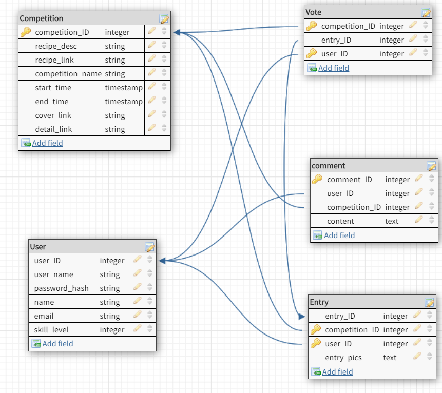
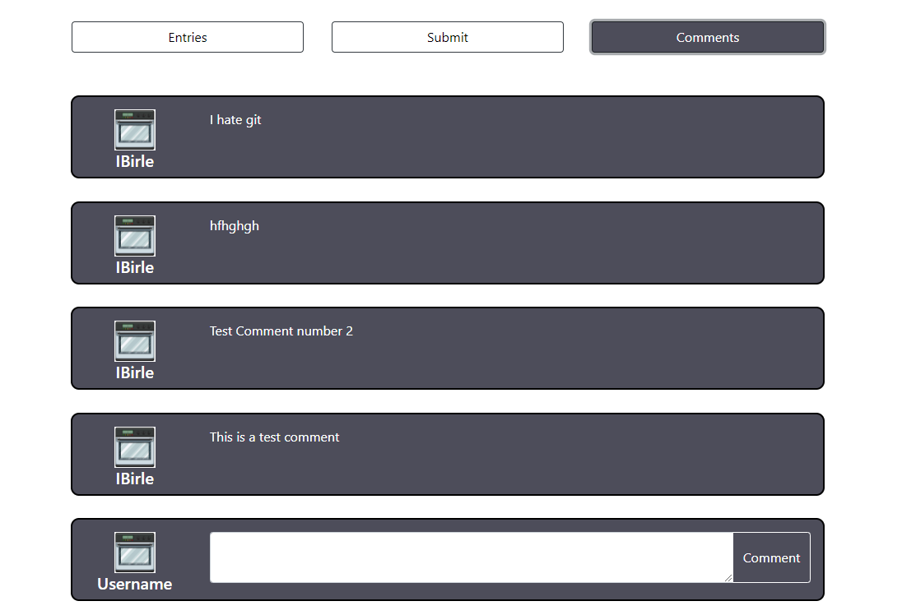

# Bake Off! (Title might change)

# Team Members:
Alain Duplan, alain-duplan
Alex Winter, alexmwinter
Ian Birle, ibirle

# Changes from Milestone2

As you will probably be able to tell, we just added on to our previous milestone 2 for this milestone since we had done the database setup/queries already. So the main changes we made for this milestone are as follows:
* Added Descriptions section
* Added a new api to APIs of projects for getting vote info
* Note above user interaction for how users are implimented
* Addiitons to division of labor

# Descriptions

Implemented preset "users" that will utilaize the functionalities of the website.

# APIs of Project
All of our requests are POST requests
See database diagram for the object definitions

1. /api/getChallengeVote
* Params: user_ID, challenge_ID
* Returns: Array of the vote informaton from the vote table
2. /api/getAllCurrentChallenges
* Params: None
* Returns: Array of Competition objects
3. /api/getChallenge
* Params: challengeID
* Returns: Returns one competition object with competition_id = challengeID 
4. /api/getEntries
* Params: challengeID
* Returns: Returns all entry objects with competition_id = challengeID
5. /api/getComments
* Params: challengeID
* Returns: Returns all comment objects with competition_id = challengeID
6. /api/submitEntry
* Params: user_ID, competition_ID, urls (Urls are a list of the urls to the images uploaded directly to aws S3)
* Returns: nothing
*Note: Inserts a new entry into the database with the above params
7. /api/voteFor
* Params: entry_ID, user_ID, competition_ID
* Returns: nothing
*note: adds a vote in the database for the given entry with the given userID. Switches the vote if that user has already voted in this competition
8. /api/submitComment
* Params: comment_content, user_ID, competition_ID
* Returns: nothing
*note: adds a comment in the database that will be displayed in the given competition page with the username of the user_ID
9. /api/sign-s3
* Params: takes in a file signature of a file a user is trying to upload to aws S3
* Returns: url with signature to upload the previous image to
*note: This is used to validate files to allow users to directly upload images to aws S3. Gives an authorization for each image posted that S3 will except

Database Diagram

# Screenshots of 4 client interactions

Updates from Milestone 2:

NOTE: ONLY THE FIRST WEEKLY CHALLENGE HAS DATA THAT IS LOADED IN FROM THE BACK END. IT IS SET UP TO WORK, BUT ONLY THAT CHALLENGE HAS ANY DATA IN IT.

A place for users to view all current challenges they can participate in or view. Clicking on one takes them to a Challenge specific page that goes more in depth.

This is where the user will be brought to after clicking on a specific challenge from the previous index.html page. Here they will see a description of the challenge as well as a link to an outside resource for the recipe.

Below the challenge at the top of the page there are three tabs to choose from the first of which is entries. These are all current entries that have been submitted for the challenge above. The user can scroll through each of an entry’s carousel images and then choose to like any one of the entries by clicking on the empty heart that shows up on hover to cast their vote as to which entrant is their favorite.

In this middle tab of the challenge page users are able to submit pictures of their entry for other users to vote on. They can select images with the button on the left and upload them with the button on the right.

The right tab of the challenge page is for user comments on the challenge. This is for tips and tricks or just general comments on the recipe as a whole. Not too specific on this one.

# URL

Bake Off’s URL: https://bake-off-alpha.herokuapp.com/

# Division of labor

Each team member worked on a vertical chunk from front end down to the back end query. We helped each other throughout, but we listed who had the major contributions / was responsible for each part.

1. /api/getAllCurrentChallenges
* Ian and Alex
2. /api/getChallenge
* Alex
3. /api/getEntries
* Alex
4. /api/getComments
* Alain
5. /api/submitEntry
* Ian
6. /api/voteFor
* Alex
7. /api/submitComment
* Alain
8. /api/sign-s3
* Ian
9. /api/getChallengeVote
* Ian, Alex, and Alain

Connection to Heroku and AWS S3: Ian